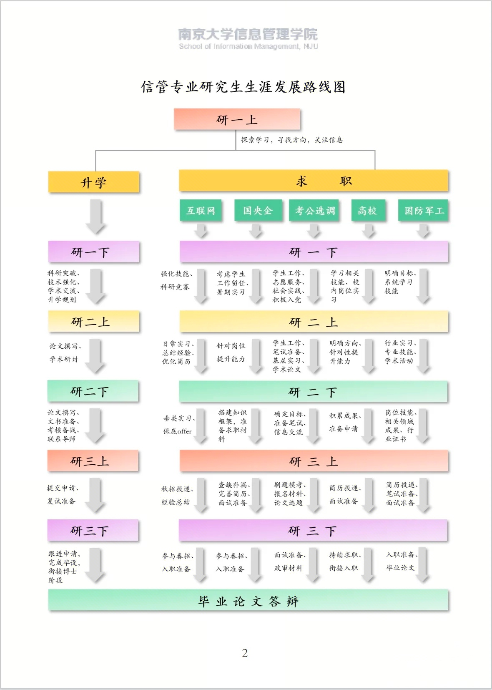

# LJY_information-_resources_management
作为某985信息资源管理类学生本科期间总结

目前为止尚待编辑

---------------------------------
+ 本文档受限于本人专业知识，并不全面，仅作参考
+ 本文档协议禁止商业用途，欢迎一切完善和分享

---------------------------------

## 目录
- [LJY\_information-\_resources\_management](#ljy_information-_resources_management)
  - [目录](#目录)
  - [学科定位及相关学科介绍](#学科定位及相关学科介绍)
    - [研究生阶段细分](#研究生阶段细分)
    - [博士阶段细分](#博士阶段细分)
  - [未来规划](#未来规划)
    - [升学](#升学)
      - [保研流程](#保研流程)
      - [考研流程](#考研流程)
      - [院校层次](#院校层次)
      - [出国](#出国)
        - [时间安排](#时间安排)
        - [国家\&学校选择](#国家学校选择)
    - [就业](#就业)
  - [竞赛](#竞赛)
  - [知识体系](#知识体系)
    - [信管如何转码](#信管如何转码跨保跨考就业于计算机)
    - [信管需要补充商学/经济学知识吗](#信管需要补充学商学经济学知识吗)
    - [需要具有的基础知识](#需要具有的基础知识)
    - [专业知识](#专业知识)
    - [课外需要知道的知识（不定期补充）](#课外需要知道的知识不定期补充)
  - [科研](#科研)
    - [研究方向介绍（部分](#研究领域部分)
    - [期刊](#期刊)
    - [会议](#会议)
    - [如何选题](#如何选题)
    - [研究方法&理论框架(部分)](#本人了解过的理论和方法不定期补充)
  - [好用的工具、公众号、网页](#好用的工具公众号网页不定时更新)
  - [本人的笔记分享](#笔记分享)
-----------------------------------
## 学科定位及相关学科介绍
*这里以本人的大白话描述，而并非专业定义 **所以请不要把这些话说给专业老师听***

    理解角度1：
        信息资源管理，简称信资管/信管，在中国官方学科定义下属于管理学（社会科学），但根据开设院校的培养目标不同，可能被授予管理学/商学/经济学/工学学位。总的来说各校差别很大。
        而在国外，参考Web of Science及JCR，则绝大部分被分类在Computer Science（计算机科学）下的information&library science（信息科学与图书馆学）；部分被分类在管理学/经济学/商学；部分研究领域可能被分在哲学（信息哲学、信息伦理、耗散结构理论）/法学（信息法、知识产权）/政治学（智慧政府、信息政策）/历史学（文献保护、归档、文化遗产）/理学/文学/传播学/医学/工程学等领域下。
        之所以这么复杂，是因为本学科是由很多个学科合并、改名过来的，演变历史极其繁杂。

    理解角度2：
        不太严谨地来说，信息资源管理=图书馆学+情报学+档案学+管理学+计算机科学（部分）+商/经济学（部分）。但除此之外，很多理论涉及哲学、传播学，所用到的研究技术涉及到网络/系统科学、统计学/计量学、计算机科学/软件科学。很难说某个领域与信管完全无关。

    理解角度3：
        如果你的专业是信息系统与信息管理、经济信息学、大数据管理与应用，那么你属于信管的大家庭。
        如果你的专业是地理信息学（地信）、生物信息学（生信）、医学信息学（医信）等等，那么你属于信管的近亲，但因为专业化的程度过高，所以被分属到了地理学/生命科学/医学领域里。 
    
    理解角度4：信管和计算机的区别
        计算机更关注怎么改进技术，会被信管吐槽为“唯技术论”。信管只把先进技术当成完成管理信息资源这个目标的一种选择。

* **关系最近的几个学科**
  * **计算机科学**。因此很多信管人不想待在本专业会跨考/保计算机。但需要补专业课，毕竟信管并不以计算机为主。
  * **管理科学与工程**。 首先两个学科的很多知识与研究领域很相似（但差别也很大），其次由于历史原因，信息系统与信息管理这个专业在很多学校被开设在商学院下，并且不归于信息资源管理而是归于管理科学与工程下。
  * **大数据管理与应用**。 其实理论上应该和信管是非常不同的，但由于各种原因，在大多院校和信管差别不大。有些院校将大数据开设在数学学院/计算机学院，那差别可能比较大。
  * **其他** 比如新媒体专业、新闻传播专业、策展（博物馆）专业、出版专业、通信工程专业都很相关。
  
* **信管是干什么的**
    
    太广了。所以请更多参照后面的研究领域。
    * 总的来说就是研究怎么获得、组织、加工、利用信息及信息资源。只不过这个信息资源不只是网上的、还包含人、机构、场所、文化、纸质资料、~~外星机器人~~等。
    * 数据（data）、信息（information）、知识（knowledge）、智慧（wisdom）在一个专业的信管人眼里是不同的东西，**所以请不要混淆**，具体的你老师课上绝对会讲
    * 可以参考这篇专家讲解信息资源管理专业建设和发展历史的论文[《中国信息资源管理学科自主知识体系构建》](#https://kns.cnki.net/kcms2/article/abstract?v=sfGpRh49pdE5w8i8aQ5d-ovWRZO-Ode-uyU2AmoHckUocdWaN_UdMufksImoV3bSlXd7d0frqkFnhhkAduYmKLiW8uCPCQl5pynDs2F5YGUu7cFD1E27YYW9OtDvISoAHkK3bKOE9ss-Cn4zmV8GxpJLtwlo_eiF3EqDfiQVtNAU6XUN3A_7ZA==&uniplatform=NZKPT&language=CHS)

### 研究生阶段细分
    到了研究生阶段，信管人会选择专业方向，或者一些人考研时要选择与信管相关的专业，因此介绍一下各个方向大概干什么的.

    注意！！！！！下面的介绍并不全面和专业，只是让你大概了解！！！

- 经济信息学： 应该全国大部分都已经撤裁了？顾名思义，研究经济的信息的。
  - eg：建设企业用的信息系统、用技术和各种方法收集和分析商业信息  
- 医学信息学/生物信息学/地理信息学：也是顾名思义，偏向应用技术和工科，不过也可以做一些社会方向。
  - eg：医学图像识别、医院信息系统建设、医学数据分析、医院在信息和数据上的制度性困难等
  - ~~（生信、地信也都有自己的很多专门方向，不献丑了）~~
* 健康信息学：同理。而且目前研究养老还挺吃香的。
- 情报学： 注重研究情报的分析利用。就国内开设该专业的总体情况来看，其实全称应该是科技情报学。
    - eg：识别和发现最新的学科热点、识别哪些论文作者最重要、跟踪和预测科技发展趋势、怎么提高信息素养、大数据分析方法
- 图书馆学： 注重研究信息（情报）的组织和整理。
    - eg：图书馆应该怎么建设，怎么使用数字技术、某个领域中杂乱的信息怎么组织和整理，组织和整理的技术，图书馆的服务等
- 数据管理及应用：顾名思义。
    - eg：数据（包括大数据）管理的方法与技术、数据分级的制度、数据质量评价、知识的管理等
    - 南京大学有国家安全数据管理这个特色方向。
- 档案学： 和秘书学是好朋友，考公很吃香的专业，985以上不愁就业，~~工资高不高另说~~。
    - eg：档案保护，某段历史和文物相关的档案怎么建设，电子文档建设与方法、档案相关的法规
- 公安情报学： 只在一些特殊院校开设
    - eg：识别打击恐怖犯罪分子，收集情报与分析
- 出版学： ~~孩子们快跑，所有信管相关的专业里最难就业的~~。部分学校会设在文学院或新闻传播学院下，主要是信管和传播学的结合
    - eg：书籍出版的理论与方法、新技术在出版中的使用，新闻传播理论
- 博物馆与策展：一般开在历史学院下
  - eg： 如何策划展览、策展理论、博物馆建设与保存
- 古籍/文物修复/保护：顾名思义。应该只有复旦文献情报中心将其作为信管下的专业开设。
- 信息系统与信息管理：通常设立在商学院，[原因](#学科定位及相关学科介绍)在上面解释过了。
  - eg: 运筹学、优化算法、信息系统如何建设
- 信息服务与用户： 和产品经理的活差不多，研究各种和信息有关的行为，以及怎么样设计好一个服务、一个产品的实践及其理论。
  - eg： 用户画像、老年人为何抵触智能设备、信息素养、信息服务理论
  - 公共文化服务也可以归类为信息服务，但更聚焦于图书馆、美术馆这种公共文化服务机构。
- 军事情报学、农业情报学、竞争情报学...等XX情报学： 要么是不作为一个单独专业，只作为一门课程存在；要么招的人很少，只有部分单位开设，所以基本不在此提及
- 保密管理、电子商务、管理科学与工程、数据科学：应该只有武汉大学将其作为信管下的专业开设
- 其他我不知道的 ~~应该是冷门中的冷门~~
### 博士阶段细分
    博士阶段研究方向会更细，基本无法列举完全，请自行查看各个大学博士招生目录与细则
* 根据个人打听总结，想申请985信管相关博士基本上最低要1篇国内CSSCI期刊文章起，如果有英文期刊上的文章或者顶级会议文章会更好，并且要预先和对应大学的博导沟通好。
* 信管博士很欢迎有计算机背景的人。 
  

## 未来规划
    1.根据个人实践以及身边经验+网上打听。信管人在考研、就业、保研、考公、出国中5选2是常态，但5选3就要承受每样都搞不好的代价了。
    2.不过别担心，大多数人都是迷茫的多手抓。一开始就能确定目标的是极少数幸运的人。
    
### 升学
#### 保研流程
|  流程  |  学期  |  时间 | 材料（备注） |
|  ----  | ----  | ---- | ---- |
|  获得前五个学期成绩 | 寒假至大三（下）开学 | 看情况
|申请夏令营| 大三（下）上课期间| 各院校不同，最早的甚至3月开始申请| 参营论文(信管不必要，只作加分项)、成绩证明、六级证明、雅思托福（加分项）、其他各种奖状材料...
|参加夏令营|大三（下）从期末至暑假|最早6月开始|可能和课程、国际周、暑校、实训冲突|
|  获得前六个学期成绩 | 暑假至大四（上）开学 | 9月初
|提交推免资格材料|暑假至大四（上）开学|8月~9月初| 看学校细则
|报名预推免|大四（上）开学|8~9月| 成绩排名/推免资格证明、各种材料证明，同上。参加预推免≠有推免资格
|参加预推免初试&复试|大四（上）开学|9月| 此时你不一定知道自己是否有推免资格
|注册学信网&推免系统|大四(上)|9月15号往后|
|学校录入推免资格|略 |约9.20往后| 可以开始填报推免志愿
|正式推免，九推、十推|略|9月~10月|填报志愿→收到复试通知→复试→收到录取→规定时间内必须确认录取。 在系统关闭之前和确认录取之前可以反复填志愿（俗称九推、十推）。 夏令营和预推免帮你省去的是此时的复试。 很多院校这个阶段已经确认了要招的学生，不再进行复试，直接发录取，所以预推免和夏令营很重要。 但如果没招满，被学生鸽了，就可以被捡漏了。

    1.预推免时你不知道自己是否具有推免资格，因此要做好竹篮打水一场空，或者忽然获得保研资格的心理准备
    2.除非放弃保研资格/直到推免系统关闭时都没有被任何学校录取，否则获得推免资格后不得报名考研
    3.根据身边人的经验，保研人最具有性价比的选择是研究历年保研细则，所有不加分的课程都混到及格就好，听多了甚至浪费，夏令营和预推免时很少看的。尽管我个人认为这种行为比较缺德。

#### 考研流程
    考研流程很简短，记得确定自己要考的科目，学硕和专硕考的科目是不同的。
    如果确信自己能考上，那可以提前联系想跟的导师了。
10月报名→12月考试→等复试通知→复试→调剂（如有）→确认录取

#### 院校层次
只针对狭义的信息资源管理本学科，不包含信息管理与信息系统、大数据管理与应用、以及跨保等情况 
**免责声明：纯属个人观点**

    TOP：武汉大学
    次一级：南京大学、中国人民大学、北京大学、中科院文献情报中心、复旦文献信息中心
    次二级：各985、211。

#### 出国
    以下所有讨论建立在无缝衔接的情况下。
    但你既然选择留学了，说明家里条件不错，其实完全可以gap一年
    也可以工作几年再去留学
**对任何想要出国的信管人来说，总绩点和语言成绩是你最首要保证的东西** 
##### 时间安排
|事项|所需时间|建议 |费用
|---| ---| ---| ---|
|学语言（小语种）|阿拉伯语1.5年 德、法、西语1年 日、韩、6个月| 尽早开始。建议大二上就开始准备|学费8k~3w 考试费2k/次 ~~有些人会自学~~
|英语|六级500分以上3个月可以速成7.0 极限情况1个月可以7.0 不考听力的省份的高考生再加2个月|大三(下)速成，学多了浪费|学费2k~3w， 考试费2k/次
|GRE、GMAT、APS、SIM等考试|0.5~1年|不难但是非常多，要花时间|看情况
|签证、推荐信、各种材料|2个月之内一般都可以结束|和导师打好关系 签证要做好准备|看情况|
|面试（如有）|~~一个月突击复习~~|口语不好建议从大二就开始练习|？|

##### 国家&学校选择
|国家|学校|建议 |费用|
|---| ---| ---| ---|
|美国|太多了| 有钱人可以去，QS够高|50w~100w/年起步
|英国|太多了|有钱人可以去|50w~70w/年
|德国|慕尼黑工业大学、慕尼黑大学、柏林洪堡大学、亚琛工业大学|德国要求课程匹配度，国内的信管人可能要多选经济学/计算机相关的课程|15w~30w/年
|香港|港三港五|基本奔着水学历然后就业去的|30w~60w/年|
|加拿大|多伦多大学、不列颠哥伦比亚大学、麦吉尔大学|有钱人可以去|40w~70w/年|
|芬兰、瑞士、澳大利亚、新西兰、法国、马来西亚、西班牙、日本、爱尔兰|看QS排名|可以去|略

### 就业
    总体来说，由于小企业通常不需要情报分析，大企业又可以找咨询公司，加上信息资源分布不均衡的特点。信息资源管理本专业对口的岗位基本在泛体制内（国企、军工、编制、公务员
    ），绝大多数本专业学生毕业也在泛体制内的岗位上。

**建议①：学会装饰简历~~造假~~，绝大多数企业不会背景调查应届生，除非太容易查了** 
**建议②：如果只想就业，那各成绩只要不挂科就行,从大一下就可以开始投实习，~~虽然不好投~~** 
**建议③：信管专业课有些在就业时很有用，比如信息服务/用户研究直接和产品经理岗位对口，这些课要学好**
|职业|特殊性|备注|年薪（不考虑未来涨薪） **企业、地区间差异很大，仅作参考**|
|---|---|---|---|
|产品经理|看重实习经历|学好信息服务/用户研究、信息系统|12w~25w~50w|
|AI产品经理|新职业|需要充分学习大模型原理并上手做过项目；了解各大AI产品背后的技术原理与优缺点|普遍高于一般产品经理|
|算法|特别看重技术。相关论文、学历、机试成绩都很重要 分方向：比如推广搜或者大模型，都需要相关知识|在leetcode上刷足算法题,至少三个月 多看算法导论 信管人很难发计算机的顶刊，但还是有机会的，面试时上机测试的成绩更重要|30w~50w~100w上不封顶
|软件测试/运维|需要额外学习相关知识|门槛和上限都不高，可替代性强，技术含量低，但反过来说也好进|12w~25w~50w|
|数据分析|大企业才有岗位|上限不高，互联网界的农民工，很多不接触实际业务，只需要用SQL|15w~25w~50w|
|采购、物流管理、客户经理、营销、HR...|看重实习|这个最卷|12w~20w~35w|
|开发|前端&后端|前端要求熟练度 后端要求对口，比如bilibili的后端用的是go语言，需要自学 多刷leetcode|20w~40w|
|云计算、物联网、硬件工程师..|和信管基本无关了，全靠自学|其实不算特别难，但和信管能学到的技能基本无关了|差异过大|
|泛体制内|应届生校招很好找|大多数人的去向 需要选调/考公/考编 会比较看重学生干部、社团、奖学金等经历 图书馆的岗位都要考，所以也分在这|8w~15w~20w~~不敢多说~~|
|高校/科研院所|硕博起步|看论文、科研、项目经历,985高校基本要n篇CSSCI+主持省级及以上项目+至少1篇英文顶刊起|看院校和科研|
|其他|看职业需求|比如游戏开发需要学会C++和Unity等|略|

可以参考 

## 竞赛
    只列出了部分大众点的竞赛
    这里有些竞赛是为了保研/考研（具体要看各个院校认不认），有些竞赛是为了给就业增添履历
    ！！！！！不要觉得我先学会了再参加比赛，大学四年来不及的，一定要边参加边学！！！
|竞赛|说明|时间（开始时间）|如何准备|
|---|---|---|---|
|大创（大学生创新创业训练计划）|3~5人，持续一整年，想保研的话最晚大三上参加并要申请提前结题|通常每年3-5月或9-11月（各校时间不同，需关注学校通知）|提前带着选题想法找导师|
|大挑（“挑战杯”全国大学生课外学术科技作品竞赛） 小挑(“挑战杯”中国大学生创业计划大赛)|大挑小挑每年交替举办 大挑搞学术理论，需要带着论文参赛，要提前一年准备 小挑搞创业，写计划书|看学校|比较看脸看导师看人员看PPT|
|互联网＋（中国互联网+大学创新创业大赛）|最后国家级基本全是千万级别的企业神仙打架 工科医科商科为主、信管人一般凑不上热闹 ~~基本都是祖传的项目在一个导师手里代代流传~~|3月~5月|攀关系，找导师，充当数据分析或美工蹭一下|
|各种商赛|分三创赛（全国大学生电子商务创新创意创业挑战赛）和各种企业举办的商赛|看学校|找商学院、经济学院的组队|
|全国信息资源管理案例分析大赛|人大举办，决赛可以直通夏令营 可以在人大官网和公众号看看每年的参赛题目和决赛题目（~~好像原则上结束了也不会公布，但可以从人大信管院决赛发的新闻稿的截图上扒出来~~）  怎么写案例可以参考[全球案例发现系统](https://www.htcases.com/index.html)以及[中国管理案例共享中心](http://www.cmcc-dlut.cn/Home/Index)，但找案例就比较看运气了|1月|①自己曾经做过某些项目 ②找导师要资源  ③自己找比较困难|
|上海图书馆开放数据竞赛|赛道很多，可以投论文，也可以做软件。 ~~目前来说认可度比较低~~ 比赛本身很麻烦，因为比赛的数据要签各种协议和许可|4月|提前三个月准备，该比赛比较卷但比较公平|
|ACM|计算机算法类的竞赛含金量还用说吗。ACM金牌直接就业都被抢着要|3月~5月|疯狂刷题|
|蓝桥杯|计算机类比赛，3人组队参加，可以突击准备，拿奖不算特别难 ~~含金量在逐年下降~~|4月|刷题学习|
|全国大学生数学建模大赛|拿奖比较容易|5月~9月|暑期和组员集中学习刷题|
|全国大学生统计建模大赛|同上|2月|同上|
|美国大学生数学建模竞赛（MCM/ICM）|比国赛更看重思路和美观度|1月|同上|
|大学生"AI+信息素养"大赛|很多学校不太认可|7月|看官网的培训课，参加学校的比赛培训|
|kaggle|国外的比赛，就是做一个机器学习和数据科学的项目，历年的题目都是很好的项目经历; 就业有一定认可度|不定时|做项目|
|其他各种比赛|计算机类的比赛还有很多，以及各个其他专业的竞赛。|||

## 知识体系
### 信管如何转码？（跨保/跨考/就业于计算机）
    想在本科或者硕士转计算机专业：
      1、补课：计算机网络、操作系统、计算机组成原理、数据结构与算法四大天王
              Java、python、C、C++、C#熟练掌握
      2、科研：尽可能和计算机学院的人合作发论文与参加比赛积累经历
      3、上机：无论是考研复试还是保研复试，都需要上机，在没有AI帮助下敲代码
      4、了解学习前沿
    已经是信管人。想就业于计算机
      1、刷题（leetcode）
      2、做项目(科研项目或者Github等网站)
      3、相关实习。如果大厂不要就先去中小厂再跳槽到大厂。
### 信管需要补充学商学、经济学知识吗？
      1、出国读信息系统方向则需要
      2、未来想跨到商科/经济，比如管理科学与工程则需要
      3、具体要补充：微观、宏观、计量经济学、企业管理、运筹学。
### 需要具有的基础知识
#### 计算机基础知识
1、计算机文化&计算机通识 
推荐视频[Crash Course: Computer Science](https://www.bilibili.com/video/BV1EW411u7th/)，书籍可以看机械工业出版社汉化的《计算机文化》一书 
让你从二进制开始，快速了解计算机的方方面面，这样你才能了解信管专业的一些玄之又玄的东西到底在说什么，实际操作起来又是什么。 
~~比学校里的大计有用~~
#
2、一些计算机常识 
  参考[计算机教育缺失的一课/The missing semester of your cs education](https://www.bilibili.com/video/BV1XN4y187zp/?spm_id_from=333.337.search-card.all.click&vd_source=f2b247acf2e198358711a504ae493770) 
  **如果你对计算机完全不感兴趣，只推荐看Git和调试与分析这两集，至少你可能会明白我这个项目是怎么上传到Github的** 
  ~~但是可能反而需要计算机常识才能看懂计算机常识，比如有些人可能不知道Linux和CMD是什么，那这种情况建议不要看~~
#
3、C语言&Python语言 
**信管人科研中用到的语言基本只有Pyhon** 
  但我只能说不学C语言，你将无法理解其他计算机语言中的许多特殊概念。推荐《C Primer Plus》一书 
  而学习Python的途径有很多，可以参考后文
#
4、计算机网络、数据结构与算法、操作系统、计算机组成原理 
和计算机打交道怎么可能不学习这四门课 
但信管只要求你了解基本原理+会简单使用就行
#
5、想要深入学习其他计算机知识? 
参考[cs自学指南](https://csdiy.wiki/CS%E5%AD%A6%E4%B9%A0%E8%A7%84%E5%88%92/) 
个人认为信管人需要深入了解计算机知识，但这点比较有争议。 比如，图书馆学的专业知识中有一个东西叫做元数据，并且早已被广泛的使用在了计算机中，而想要彻底的了解元数据中一个叫做命名空间（namespace）的概念是什么，需要了解C++语言。但C++语言对大多数信管人来说用不到，再加上其实AI可以来帮助你，所以见仁见智吧..

#### 信息检索&逻辑推断能力
1、具有信息素养 
简单来说有良好的检索思路，知道自己想要什么
 eg: 希望检索政策文件，知道可以去[国务院文件库](https://www.gov.cn/zhengce/zhengcewenjianku/index.htm)、[人民日报图文数据库](https://data.people.com.cn/rmrb/20250921/1?code=2)等等等等等地方 
想要某种产业发展的情况，除了可以找相应企业的财报或咨询报告，还可以去[国家统计局](https://www.stats.gov.cn/sj/)或者[海关](http://www.customs.gov.cn/)那里查询历年产业数据自己估算，以及等等等等。 
还有如何使用AI，如何给AI好的指令（提示词） 
想要培养这种能力可以关注[信息素养大赛](https://csc.xxsuyang.com/),即便不参加，不拿奖也可以看里面的课程培训

#
2、逻辑推断能力 
应该具有，**可以去学习逻辑学但对保研和就业没有太大用处。** 
**但如果你想考专硕，逻辑学对管综是非常有用的**

### 专业知识
1、信息系统分析与设计、开发： 
信息系统是一个很广的概念，除了能够增删改查的各种软件（*别以为只有XX管理系统才算信息系统，游戏、小程序、各种APP只要有信息流通的过程都可以算的*），还可以包含纯人力或者人与机器结合的。 
信息系统分析要求你会设计系统，能够划分出功能模块，能够绘制出数据流图、设计原型等等，并了解企业的工作流程 
信息系统设计要求你至少知道计网+数据结构，并且能够敲代码实现前端/后端中的一种，还要学会各种开发方式、软件测试，版本和项目管理等等
#
2、数据库设计与原理 
数据库原理要求会画E-R图、了解笛卡尔积，能够分好数据的依赖（主键、外键） 
数据库设计要求你会敲SQL，知道JDBC、ODBC等连接方式知道DBeaver、Navicat这些业界常用的数据库软件、知道Oracle、Neo4j、DGraph这些数据库/图数据库
#
3、信息检索原理与技术 
了解信息检索的原理、如何规划信息检索的过程和目的，搜索引擎的工作原理、如何编写检索式、各种信息检索技术
#
4、信息分析&信息组织 
信息分析的方法和技术，包括不敲代码的那种，证据分析、可信度评估之类的，还有信息分析的理论和思考方式 
信息组织原理以及各种元数据、分类法、词表、著录、建立索引、Marc等技术。 
**早在计算机发明之前就已经有信息分析和组织了，所以说这门课重在原理，敲代码是次要的**
#
5、管理学 
包括管理学的各种理论，以及从管理学中衍生出来专门的信息管理学。 
**有理论指导才能做好技术实践，别觉得这个不重要**
#
6、档案、电子文件、公文、文化遗产...管理 
**这是一个很大的范畴，可能包含非常多课程，主要由想做档案或文化遗产保护方向的人要学习。**
 具体包含了基础理论、分类、方法、原则，相关的法规、政策，开发和利用的技术，如何收纳、整理、维护、保密......
#
7、信息资源建设/图书馆资源建设+图书馆实务 
**国内教材里信息资源主要讲的图书馆（主要是学科太小），但实际上信息资源的定义范围很大** 
信息资源建设原理、方法、政策体系、法规 
怎么采购信息资源(对图书馆来说就是图书、期刊)、评估、做好规划，评级 
了解有哪些信息资源 
#
8、数学：统计学&计量学 
各种统计方法、计量方法、网络科学。 
**太多了，只举几个例子**
统计学中的因素分析、拟合，文献计量学会研究怎么给论文分级、网络计量学会统计网络中的重要节点等
#
9、电子政务、数字政府、数字治理，政府信息 
没什么好说的，就是和政府相关的信管的各种理论与方法
#
10、信息服务/用户研究、信息产品设计/信息咨询 
如何设计信息服务，设计信息服务的流程和方法，各种用户调查的方法，信息需求，信息行为 
比如脑电波仪或者眼动仪，深度访谈、用户旅程图、产品设计原型等 
信息咨询属于信息服务，就是怎么做好咨询报告，怎么查新
#
11、知识管理、知识科学、创新 
~~个人觉得比较无聊~~ 用科学的方法研究知识的分类，比如显性知识和隐性知识（难以表达的知识），如何转化，如何创新，如何促进知识在企业中共享等等
#
12、商务、工程、物流、企业信息管理 
顾名思义
#
13、知识产权、信息法 
和法学的卷。。
### 课外需要知道的知识（不定期补充）
1、ischools高校图书馆联盟： 
简单来说就是全世界一堆开设了信管专业的学校聚在一起 
2、CALIS中国高等教育文献保障系统： 
各个高校图书馆之间合作的一个大体系 
3、CSSCI中文社会科学引文索引 
南京大学开设的，本义是觉得大家都卷SCI不太好，想要破除这种唯论文、唯帽子、唯职称、唯学历、唯奖项的现象，结果现在成了收录国内社科文科几乎最顶尖的一种评价，~~成了帮凶~~ 
4、待定

## 科研

### 研究领域(部分)
    基本上就分为服务、资源、理论和技术四个板块，不定期补充；
    有些领域我自己也没深入接触过，只是以我自己的看法硬说。
    有时间可能会贴上几篇相应的论文
#
1、知识抽取、实体抽取技术 
  怎么用计算机技术把"小明吃了面包"抽取为“实体A（小明），关系（吃），实体B（面包）" 
#
2、识别技术 
  如何用计算机技术识别重要科研文献、重要作者，重要专利;预测学科热点和科技发展趋势;识别主题；总之就是识别某种特征，最近比较热的是怎么用各种技术**识别虚假信息**; 
#
3、情报研究 
  不知道怎么归类，~~很多比较分散的选题~~ 
#
4、知识创新 
  一般是案例分析，或者对某种知识理论的创新 
#
5、政府能力&政府中的数据/信息治理 
  政府相关的政策怎么评价、质量如何、提升路径和影响因素等等 
#
6、信息行为 
各种数字囤积、信息过载、信息茧房、数字鸿沟、隐私披露等等都是怎么产生的，有什么因素，该怎么解决
 
#
7、信息服务&咨询、图书馆建设 
主要围绕图书馆展开，也有围绕产品的。现在比较热的是图书馆的智慧服务要怎么构成、怎么建设、怎么评价、有哪些影响 
#
8、信息法规、信息政策 
可以多国对比，也可以找现有的问题和反思 
#
9、信息组织 
某种现实中的东西怎么组织为信息资源，比如文化遗产，比如党史资料 
#
10、用户意愿 
面对某类产品/服务，用户使用意愿如何?影响因素？可能有哪些效应和机制和特殊现象？ 
#
11、专题 
某些特殊的研究专题: 
全民阅读：阅读行为的特征、影响，如何推广阅读，作用机理 
信息素养：现在更多称为智能素养。 
开放数据：如何促进数据共享共建。~~由于政治原因，逐渐变冷门了~~ 
大模型：大模型在信管（一般指图情档）各个领域的新应用 
舆情治理/危机管理：热搜、舆情爆点、突发危机时怎么治理，信息怎么管理 
其他的还有舆情事件管理、信管学科如何发展、知识组织模式等等

### 期刊
    本学科国内期刊推荐（不分先后）：
    情报资料工作
    情报理论与实践
    情报科学
    情报学报
    图书情报知识
    现代情报
    图书情报工作
    情报杂志
    数据分析与知识发现
    中国图书馆学报
    图书馆论坛
    管理学报

    其他学科如果研究领域相关也可以看，比如管理学顶刊中的顶刊《管理世界》、还有《中国社会科学》之类的

    英文期刊：
    太多了，请你搜索Web Of Science，点击右上角Products进入JCR（Journal Citation Report）后，点击Categories进入学科分类界面，在Computer Science下选择Information & Library sciecnce后自行查看。
    如果你做的是其他学科的方向，比如数字政府或者数字贫困，也可能在其他学科的期刊下。
    个人提醒：IEEE旗下的期刊可关注，计算机技术下的其他期刊也可以关注
  
### 会议
    国外：
    ASIS&T：武汉大学主办，顶会
    UTD
    IMMS
    MIS Quarterly, 
    MS
    ISR
    ICADL
    BOBCATSSS
    IEEE旗下的会议
    IFLAWLIC
    ISIC
    ICLSISKM
    USENIX Security （过于偏技术）
    ...

    国内：请关注各学校的官网动态
    中国信息资源管理学界十大学术热点:每年会发布学术热点方向
    全国计算机信息管理学术研讨会
    全国计算机模拟与信息技术学术会议
    数智时代出版产业发展与人才培养国际学术交流会
    各种硕博会议（本科生可以偷窥别人的博士选题）比如全国图书馆学博士生学术论坛会议

### 如何选题
    如果以大一新生的视角来说，信管科研存在文和理两个方向，因此按这两个方面介绍

1、理科方向： 
  ①基本知识要求：线性代数+计算机网络+数据结构+熟悉Python（能读懂代码，并熟练地装卸各类库） 
  正如上文所说，一定要边学边做，而不是学完再做，**但还是建议至少大二学完数学和计算机语言（如有）才入手** 

  ②读懂一篇相关领域的论文，了解其中使用到的技术，到底使用这些技术干了些什么，做了些什么，创新在哪？ 
  尽管你可能不了解背后的原理，但幸亏于有AI，以及各种前人开发的工具，只要你能明白**这篇文章的这部分我不知道什么原理，但我知道它的每个部分输入了形如XX的一个东西，输出了一个形如XX的东西**就可以尝试做科研了 

  ③可以找代码复现~~但现在很多论文不会开源自己的代码~~

  ④你大致可以用以下方法进行选题： 
  尝试找出论文中可能的不足并改进，~~如果论文里自己说了不足那更好~~ 
  尝试将该论文和已经学到或新了解到的技术结合 
  尝试了解有哪些新领域还处于空白，自己用技术来进行创新（看综述或者部分论文会提及） 
  跨学科，或者用最新提出来的概念、理论、其他文科的研究成果和已有的东西，尝试把这些理论和概念转化为实际的技术成果 
  写某领域的综述 
  自己发明一个新东西、新概念，~~基本做不到~~

2、文科方向： 
①基本知识要求：统计学。**绝大多数文科研究在技术方面都有相应的傻瓜式软件了，知道背后的原理只要一天就能学会怎么用** 

②概念界定：你每提出一个想要研究的概念都要有相应的定义，已经有的概念就要找别人的定义，新的概念就要自己定义。这个东西**难者不会，会者不难**。 
eg：**一个简单的示范**：我想研究“饭搭子的影响因素”，首先要定义“饭搭子”是什么。于是我说“饭搭子”是一种指在饮食时临时结成的合作关系。那么如何找到我想研究的饭搭子们，来收集他们的数据呢？我定义为，在近一个月内和其他人吃饭次数≥1的人。 

③开展研究：文科研究基本分为三种 
1、理论创新：全篇只要论说就可以了，可以按历史回顾，也可以谈问题本身，~~不是大佬很难被认可~~ 
2、基于某种理论+用什么方法 
理论（理论框架）给你提供分析的角度，并且你可以在此基础上创新自己的分析角度 
方法，一般分定性、定量和定性定量结合三类，选合适的就行。**通常来说不会创新方法，会提出新方法的一般也都是大佬。** 
如果你听到某某创新了方法，那一般是指**对原有的方法做了特殊改进或处理、适配了一些原先用不了或没人用过的问题，或者把多个方法结合到一起**
 
eg：基于TOE理论的小明吃面包影响研究，研究方法采用了问卷调查和回归分析。 
XX质量评价研究。这种研究的理论一般是在政策文件/各种理论基础上自己搭的 
3、综述：没什么好说的，是个技术活。不怎么创新，但把综述写好又很难，反正每年都有发的。~~科研界的农民工~~

④你可以用大致以下的方法选题： 
找不足。 
找空白。 
理论创新。一般会叫XXXX视角下的XX，或者基于XXXXX的XXX 
把大点的领域做的更专门一点。 eg：信息质量→健康信息质量→网络健康信息质量→网络养生类健康信息治理 
把别的学科的研究方法想办法搬过来，一般也会叫基于XXXX的XXX 
.......~~懒得列了~~

### 本人了解过的理论和方法（不定期补充）
    理论：
    理论框架更多是借鉴前人的研究成果基础/某种政策文件/某些理论结合上自己建立，而不是抄下面这些通用方法
      TOE：技术-组织-环境框架
      PEST：过时了
      工具-任务-周期框架

    方法：
    还是按照输入什么？输出什么？这样的方式来理解。
    定性定量是什么意思自己会慢慢理解的，这里不作区分了。
      问卷调查
      深度访谈
      跟踪调查
      文献分析法
      QCA：主要用fsQCA,用得太多有点过时了
      扎根理论：用的非常多，但目前还不算过时
      回归分析：太简单了
      元人种志：偶然看见的，好像是个小众方法
      meta分析
      DEMATEL
      文本挖掘

## 好用的工具、公众号、网页（不定时更新）
~~下面不少东西大一新生可能不知道，但对熟练的人可能显得比较白痴~~ 

工具: 
[watt工具箱](https://steampp.net/)：免费加速器，打游戏的人可能知道，能让你上steam或者origin。放这主要是因为支持登Github
[Research Rabbit](https://researchrabbitapp.com/)：文献检索神器 
[AI Miner](https://www.aminer.cn/):搜索英文文献和追踪学科专家，不过AI功能比较弱智 
[各种小工具](https://study.100xgj.com/list/42):多翻翻有小惊喜 
[Zotero](https://www.zotero.org/):最好用的科研文献管理软件，秒杀NoteExpress和EndNote。但对小白来说配置有点麻烦 
[印象笔记](https://yinxiang.com/dl-win/?):也挺好用吧 
[Obisidian](https://www.zotero.org/):最好用的记笔记的软件，但可能需要一个智商正常的人花1个小时学一下Markdown语法 
[Vscode](https://code.visualstudio.com/):最大众的敲代码的编辑器 
[Pycharm](https://www.jetbrains.com/zh-cn/pycharm/):在敲Python这一门语言上比Vscode好用一点 
[Anaconda](https://www.anaconda.com/download)：Python用的环境管理软件。~~如果你知道环境是什么的话~~ 
[Jupyter](https://jupyter.org/)：一般在Python上用的，可以把每一步的结果都直观地展示出来 ~~小白别碰~~ 
[MathType](https://mathtype.org/):数学公式编辑器，可以和Word、Latex联动。打数模比赛和写论文会用上 
[WolframAlpha](https://www.wolframalpha.com/)：科学计算器，可以积分微分并**展示过程**，学微积分的时候你会感谢我的 
[Pincode](https://pingcode.com/)：项目管理软件，有很多类似的，这里只放一个 
[Ipaddress](https://www.ipaddress.com/):查自己的IP地址 
[蓝湖](https://lanhuapp.com/sso/#/main/home):可以协作的产品设计、网页设计网站 
[NetworkX](https://networkx.org/)、[igraph](https://igraph.cn/)、[Gephi](https://gephi.org/)：都是做社会网络分析会用到的网络分析软件，三选一即可 
ROSTCM6：做政策文本分析、情感分析的软件，好像没有官网。其实这类软件你都可以自己敲Python解决 
[SPSSPRO](https://www.spsspro.com/):你可能知道统计分析软件Spss，这个是网页版，以牺牲部分功能的代价换来了更方便和更傻瓜式的操作 

网页： 
[Github](https://github.com/)：会用计算机的人都知道的开源代码网站。要翻墙 
[LeetCode](https://leetcode.cn/)：前面提到好多次了，几乎最大的程序员刷题网站，就业和考试题都有 
[StackOverFlow](https://stackoverflow.co/)：外国最大的程序员问答社区，天天被国内抄袭 
[博客园](https://www.cnblogs.com/)：国内的问答网站，这类网站挺多的，我就在这只放几个 
[SegementFault](https://segmentfault.com/):也是程序员问答网站 
[编程词典](https://www.codefather.cn/dict) 
[菜鸟教程](https://www.runoob.com/):学技术的 
[Z-Library](https://zh.zlibrary-sg.se/)：免费书，在国外可能违法。有很多盗版网站。~~我也不知道我这里这个是不是正版~~ 
[The Hitchhiker's Guide to Python](https://docs.python-guide.org/):学Python的英文指南 
[Codedex](https://www.codedex.io/python)：用游戏的方式学代码，目前只有Python做的比较好，但比较基础 
[Process On](https://www.processon.com/):大多数人绘制流程图的选择，在一定张数内免费 
[excalidraw](https://excalidraw.com/)：免费的绘制流程图的网页，还支持多人协作 
[集智学院](https://campus.swarma.org/):花钱上别的学校的正式课，不过非常贵。但有些课你不想看书自学的可能也就这里和Youtube上有了，~~比如网络科学。。。~~ 
[英语真题在线](https://zhenti.burningvocabulary.cn/)：免费做四六级和考研英语题 
[CSdiy](https://csdiy.wiki/)：前面提到过了，一个北大大佬写的计算机自学攻略 
[顾如](https://www.patentguru.com/cn)：搜索专利很好用 
[中国科学院文献情报中心知识服务平台](https://www.las.ac.cn/)：这网站很多功能都很好用 
[LKS推荐网站](https://lkssite.vip/)：有些网站还挺实用的 
各类在**专业领域里权威**但又没知网和Web of Science知名的文献库: [arXiv](https://arxiv.org/)、[Pubmed](https://pubmed.ncbi.nlm.nih.gov/)...

公众号&社交媒体: 
复杂系统与复杂性科学 
工程管理前沿 
计量经济圈 
立方数据学社 
情报学报 
武大信管 
RUC信息资管理学院 
数字人文研究 
图清档学界 
图书情报知识 
运筹OR帷幄 
计算政治学Community 
档案那些事儿 
中国档案学会 
网安寻路人 
图情招聘：**想依靠信管本专业本专业就业的话这个必看** 

日更图情选手:小红书、B站都有号，主要和考研、择校相关 
zh多发文章：小红书。图情方向很厉害的学者
